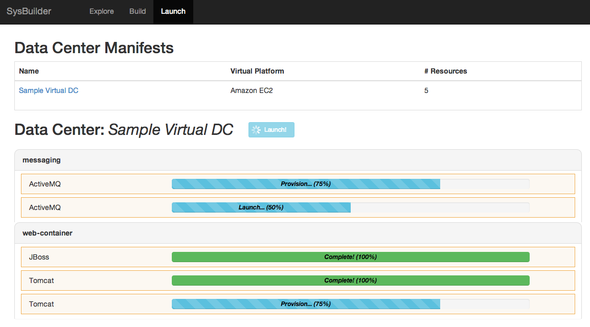

# SysBuilder

SysBuilder is a virtual data center configuration tool that allows for automatic
provisioning of a cloud-based data center based on user-selected components.

## Configuration

Clone the Sysbuilder software from github:

```bash
git clone git@github.com:jekhokie/sysbuilder.git
```

Once cloning the project, copy the sample files:

```bash
cp config/faye.yml.sample config/faye.yml
cp config/categories.yml.sample config/categories.yml
cp config/components.yml.sample config/components.yml
cp config/compute_providers.yml.sample config/compute_providers.yml
```

Edit the faye setting file to specify the settings for your environment.

* config/faye.yml

```yml
protocol: "<URL_PROTOCOL>"
host:     "<HOST>"
port:     "<PORT>"
```

Where:<br/>
`<URL_PROTOCOL>`: Protocol for the URI (http or https)<br/>
`<HOST>`: Hostname or IP of the Rails/Faye server<br/>
`<PORT>`: Port of the Rails/Faye server

Create the Faye token and initialize to something unique.

```bash
echo "FAYE_TOKEN='<CUSTOM_FAYE_TOKEN>'" >> config/initializers/faye_token.rb
```

Where:<br/>
`<FAYE_TOKEN>`: Unique string of letters, characters and numbers that represents a security token for the Faye pub/sub capability

Edit the categories setting file to include the different categories that you wish to make available for the user to assign software to.

* config/config/categories.yml

```yml
:<CATEGORY>:
  :category: "<CATEGORY_TAG>"
```

Where:<br/>
`<CATEGORY>`: Name of the category that will be displayed in the web interface<br/>
`<CATEGORY_TAG>`: Tag for the category used internally to decide which components can
be configured within the <CATEGORY> field

Edit the components setting file to include all the possible components that the user can assign to the various categories. Note that these components will need to be Puppet-backed for provisioning purposes. As the software is a generic container, it makes no assumptions nor does it deliver any provisioning capability specific to software solutions.

* config/components.yml

```yml
:<COMPONENT_CATEGORY>:
  :<COMPONENT_NAME>:
    :tag:      "<COMPONENT_TAG>"
    :category: "<CATEGORY_TAG>"
    :versions:
      - "<VERSION>"
      - "<VERSION>"
```

Where:<br/>
`<COMPONENT_CATEGORY>`: Name of the group within which this component falls<br/>
`<COMPONENT_NAME>`: Actual name of the component that will show up in the web interface<br/>
`<COMPONENT_TAG>`: Tag for the component that is used for provisioning scripts to identify the specific component<br/>
`<CATEGORY_TAG>`: Category to which this component belongs and can be configured within<br/>
`<VERSION>`: Versions of the component that can be auto-provisioned by the provisioning scripts

Edit the compute providers setting file to include the various provider configurations. Currently, the only two providers that are/will be supported for the foreseeable future are Vagrant (native) and Amazon Web Services using the Vagrant AWS Plugin.

* config/compute_providers.yml

```yml
:<PROVIDER_NAME>:
  :<COMPUTE_RESOURCE_NAME>:
    :cpu:  "<COMPUTE_CPUS>"
    :mem:  "<COMPUTE_MEMORY>"
    :disk: "<COMPUTE_DISK>"
    :cost: "<COMPUTE_COST_HR> /hr"
```

Where:<br/>
`<PROVIDER_NAME>`: Name of the provider that will be interfaced with for creating the virtual instances<br/>
`<COMPUTE_RESOURCE_NAME>`: Name of the resource for identification in the UI<br/>
`<COMPUTE_CPUS>`: Number of CPUs that the compute resource will contain<br/>
`<COMPUTE_MEMORY>`: Amount of memory (in MB) that the compute resource will contain<br/>
`<COMPUTE_DISK>`: Amount of disk storage (in GB) that the compute resource will contain<br/>
`<COMPUTE_COST_HR>`: The cost of running this instance per hour

### Server

Start the Rails server:

```
rails s
```

## Providers

This application uses Vagrant to support vagrant local VMs through VirtualBox as well as Amazon Machine Images through Amazon Web Services. Install the Vagrant application and the vagrant-aws plugin:

```
rpm -ivh https://dl.bintray.com/mitchellh/vagrant/vagrant_1.6.3_x86_64.rpm
vagrant plugin install vagrant-aws

# install a dummy box for Vagrant
vagrant box add dummy https://github.com/mitchellh/vagrant-aws/raw/master/dummy.box
```

### Vagrant Provider

There are no special requirements for Vagrant to function as a provider for the virtual data center. Simply installing the application following the instructions above suffices.

### Amazon Web Services (AWS) Provider

In order to use AWS as a provider through Vagrant, you are required to sign up with an AWS account. After doing so, copy and edit the aws_settings.yml file to capture the required information.

Create an Amazon Web Services account following the instructions on the Amazon site:

[AWS Signup](http://aws.amazon.com/free/ "Amazon Web Services")

Create a keypair with a known name through the AWS Identity service. *Make sure that you download and store the private key in a secure location as this is the only time you will be able to retrieve it*.

Copy and configure the AWS configuration file based on the credentials defined when signing up as well as the key information for the SSH key generated.

```bash
cp config/aws_configs.yml.sample config/aws_configs.yml
```

* config/aws_configs.yml

```yml
:aws:
  :access_key:        "<AWS_ACCESS_KEY>"
  :secret_key:        "<AWS_SECRET_KEY>"
  :ssh_key_name:      "<SSH_KEY_NAME>"
  :ssh_priv_key_path: "<SSH_PRIV_KEY_PATH>"
```

Where:<br/>
`<AWS_ACCESS_KEY>`: Access key from the AWS signup<br/>
`<AWS_SECRET_KEY>`: Secret key from the AWS signup<br/>
`<SSH_KEY_NAME>`: Name of the SSH key generated in the AWS Identity service<br/>
`<SSH_PRIV_KEY_PATH>`: Path (locally) to the SSH private key saved from the generation of the key-pair through the AWS Identity service

## Screenshots

### Explorer

Main screen that shows a listing of all the created manifests (virtual data center definitions) within the system. This list can be picked from to use/provision existing manifests, and shows the associated costs for running each.


### Builder

The meat and potatoes of the Sysbuilder tool. This is where you start constructing your software mappings to virtual resource types. Make sure to pay careful attention to the numbers - your system can get more expensive than you think!


### Launcher

Provision a previously-configured Manifest using the provider desired, and get realtime feedback of the progress.


